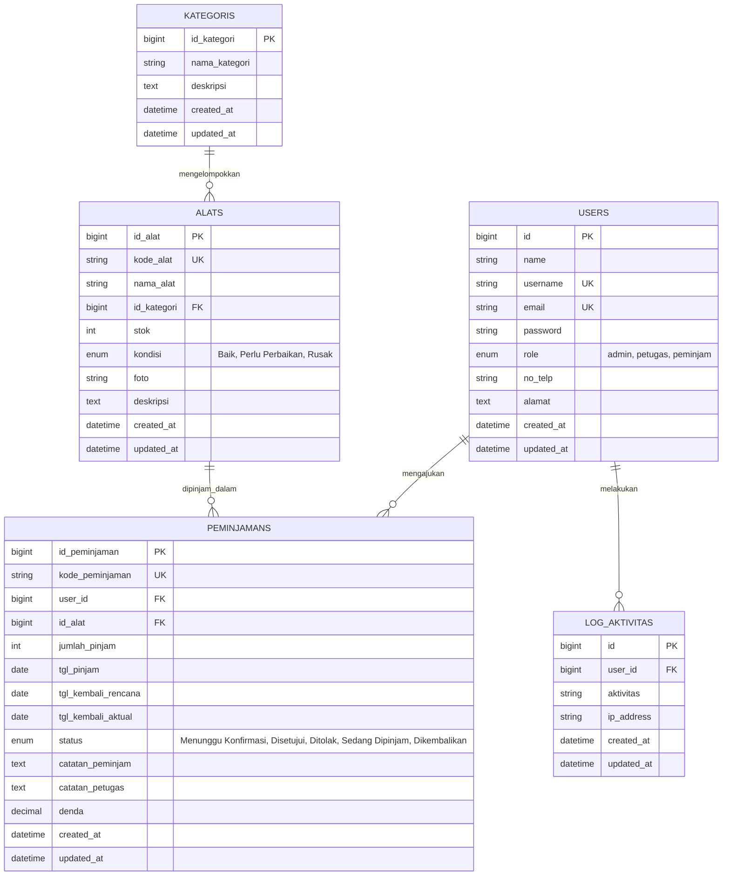

# DOKUMENTASI TEKNIS SISTEM APLIKASI PEMINJAMAN SARANA SEKOLAH
**Uji Kompetensi Keahlian (UKK) Rekayasa Perangkat Lunak (RPL) 2025/2026 - Paket 1**

---

## 1. Deskripsi Singkat Aplikasi
Aplikasi **Peminjaman Alat & Sarana Sekolah** adalah sistem informasi berbasis web yang dirancang untuk mendigitalkan dan mengotomatisasi proses peminjaman sarana dan prasarana sekolah. Sistem ini memfasilitasi 3 tingkat hak akses (*Role-Based Access Control*):

1. **Administrator:** Memiliki hak penuh untuk mengelola master data pengguna, kategori barang, katalog inventaris alat, audit log aktivitas, memantau seluruh transaksi peminjaman, serta mencetak laporan rekapitulasi resmi.
2. **Petugas Sarpras:** Mengelola operasional sirkulasi alat, melakukan verifikasi persetujuan (*approval*) atau penolakan pengajuan peminjaman, memproses pengembalian alat, dan membebankan denda keterlambatan secara otomatis.
3. **Peminjam (Siswa / Guru):** Melihat katalog ketersediaan stok alat secara *real-time*, mengajukan peminjaman secara mandiri, memantau status pengajuan, serta mencetak bukti tanda terima peminjaman digital.

---

## 2. Diagram Hubungan Antar Entitas (ERD)

---

## 3. Akun Pengujian Default (Demo Credentials)

| Role | Username | Password | Deskripsi |
| :--- | :--- | :--- | :--- |
| **Administrator** | `admin` | `admin123` | Akses seluruh fitur master, user, laporan, dan log |
| **Petugas Sarpras** | `petugas` | `petugas123` | Akses persetujuan & pengembalian peminjaman |
| **Peminjam (Siswa 1)** | `siswa1` | `siswa123` | Siswa XII RPL 1 (Pengajuan pinjam & tracking) |
| **Peminjam (Siswa 2)** | `siswa2` | `siswa123` | Siswa XII RPL 2 |

---

## 4. Dokumentasi Modul & Fungsi Utama (Clean Architecture)

### A. `AuthController`
* `showLogin()`: Menampilkan antarmuka form login dengan tombol 1-Click demo credentials.
* `login(Request)`: Memvalidasi kredensial pengguna, membuat sesi, dan mencatat log login.
* `showRegister()` & `register(Request)`: Registrasi mandiri untuk siswa baru dengan enkripsi password Bcrypt.
* `logout(Request)`: Menghancurkan session dan mencatat waktu keluar pengguna.

### B. `DashboardController`
* `index()`: Mengagregasikan metrik KPI secara dinamis berdasarkan peran:
  * Bagi Admin/Petugas: Total Alat, Stok Fisik, Peminjaman Menunggu Review, Peminjaman Aktif, Total Pengembalian, Total Denda, Transaksi Terkini, dan Log Aktivitas.
  * Bagi Peminjam: Total pinjaman sendiri, status pengajuan aktif, dan rekomendasi alat yang siap dipinjam.

### C. `PeminjamanController`
* `index(Request)`: Menampilkan daftar transaksi dengan filter multi-kriteria (Status, Rentang Tanggal, Peminjam, Kata Kunci).
* `create()` & `store(Request)`: Validasi ketersediaan stok, batas tanggal, pembentukan kode unik transaksi (`PINJAM-YYYYMMDD-XXXX`), dan pengurangan stok otomatis.
* `approve(Request, $id)`: Persetujuan pengajuan oleh petugas sarpras dan penguncian kuota stok gudang.
* `reject(Request, $id)`: Penolakan pengajuan disertai catatan alasan penolakan.
* `returnItem(Request, $id)`: Proses pengembalian barang, pemulihan stok alat, dan kalkulasi otomatis denda keterlambatan (Rp 5.000/hari terlambat).
* `show($id)`: Format tanda terima / kuitansi digital bukti peminjaman resmi.

### D. `LaporanController`
* `index(Request)`: Pratinjau rekapitulasi data peminjaman dengan ringkasan metrik total transaksi, total unit, dan total denda.
* `cetak(Request)`: Tampilan dokumen laporan resmi berformat A4 dengan Kop Surat Dinas Pendidikan dan kolom tanda tangan Kepala Jurusan & Petugas Sarpras.

### E. `AlatController` & `KategoriController`
* Pengelolaan inventaris sarana (CRUD), upload foto dokumentasi barang, validasi stok, serta pengelompokan jenis peralatan.
