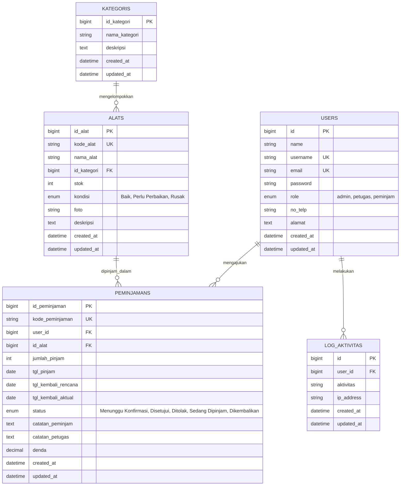

# 📦 Sistem Aplikasi Peminjaman Alat & Sarana Sekolah
**Uji Kompetensi Keahlian (UKK) Rekayasa Perangkat Lunak (RPL) 2025/2026**


Aplikasi berbasis web modern untuk mendigitalkan pengelolaan sirkulasi, inventarisasi, peminjaman, dan pengembalian sarana prasarana sekolah secara transparan, efektif, dan akuntabel.

---

## 🌟 Fitur Utama Sistem

### 1. 🛡️ Multi-Level User Access (RBAC)
* **Administrator:** Akses penuh manajemen master data (kategori, inventaris alat), manajemen user & hak akses, audit log aktivitas sistem, pemantauan seluruh transaksi, serta ekspor/cetak laporan sirkulasi resmi.
* **Petugas Sarpras:** Memproses persetujuan (*approval*) atau penolakan pengajuan peminjaman, memverifikasi pengembalian alat, dan membebankan denda keterlambatan secara otomatis.
* **Peminjam (Siswa / Guru):** Eksplorasi katalog inventaris alat dan ketersediaan stok *real-time*, mengajukan pinjaman alat secara mandiri, melacak status pengajuan, serta mencetak bukti kuitansi digital peminjaman.

### 2. ⚡ Alur Transaksi Otomatis (*Lifecycle Management*)
* **Auto-Lock Stock:** Stok alat di gudang otomatis dikurangi saat pengajuan disetujui dan otomatis dipulihkan ke gudang saat alat selesai dikembalikan.
* **Kalkulasi Denda Otomatis:** Sistem secara otomatis mendeteksi keterlambatan pengembalian dan menghitung nominal denda harian (Rp 5.000/hari).
* **1-Click Demo Login:** Tombol login cepat di halaman login untuk mempermudah penguji atau penilai saat demonstrasi aplikasi.
* **Laporan Resmi Siap Cetak (A4 PDF):** Dilengkapi format Kop Surat Dinas Pendidikan resmi dan kolom tanda tangan Kepala Jurusan serta Pengelola Sarpras.
* **Audit Trail / Activity Log:** Mencatat riwayat login, tambah, ubah, dan hapus data beserta alamat IP pengguna.

---

## 📊 Diagram Relasi Database (ERD)



---

## 🔑 Akun Pengujian Default (Demo Credentials)

| Role / Tingkat | Username | Password | Keterangan |
| :--- | :--- | :--- | :--- |
| **Administrator** | `admin` | `admin123` | Akses seluruh master data, user, log, dan laporan |
| **Petugas Sarpras** | `petugas` | `petugas123` | Akses verifikasi peminjaman & pengembalian |
| **Siswa (Peminjam 1)** | `siswa1` | `siswa123` | Akun Siswa XII RPL 1 (Katalog & Form Pinjam) |
| **Siswa (Peminjam 2)** | `siswa2` | `siswa123` | Akun Siswa XII RPL 2 |

---

## 🚀 Panduan Instalasi & Menjalankan Proyek

Ikuti langkah-langkah berikut untuk menjalankan aplikasi di lingkungan komputer lokal Anda:

### 1. Clone Repositori
```bash
git clone https://github.com/Artvael/UKK-RPL.git
cd UKK-RPL-Miko
```

### 2. Install Dependensi PHP
```bash
composer install
```

### 3. Konfigurasi Environment (`.env`)
Salin file konfigurasi contoh:
```bash
cp .env.example .env
```
Buka file `.env` dan pastikan pengaturan database sesuai dengan MySQL Anda:
```env
DB_CONNECTION=mysql
DB_HOST=127.0.0.1
DB_PORT=3306
DB_DATABASE=peminjaman_barang
DB_USERNAME=root
DB_PASSWORD=
```

### 4. Setup Database (Pilih Salah Satu Cara)

* **Cara A (Menggunakan File SQL Dump yang Disertakan):**
  1. Buat database baru di MySQL bernama `peminjaman_barang`.
  2. Import file [`database/peminjaman_barang.sql`](database/peminjaman_barang.sql) melalui phpMyAdmin / HeidiSQL / DBeaver.

* **Cara B (Menggunakan Artisan Migration & Seeder):**
  ```bash
  php artisan key:generate
  php artisan migrate:fresh --seed
  ```

### 5. Buat Symlink Storage (Untuk Gambar/Foto Alat)
```bash
php artisan storage:link
```

### 6. Jalankan Server Aplikasi
```bash
php artisan serve
```
Akses aplikasi melalui browser di alamat: [**http://127.0.0.1:8000**](http://127.0.0.1:8000)

---

## 📁 Struktur Direktori Utama

```
UKK-RPL/
├── app/
│   ├── Http/Controllers/          # Logika bisnis (Auth, Dashboard, Alat, Peminjaman, User, Laporan)
│   ├── Http/Middleware/           # Role-based middleware filter
│   └── Models/                    # Eloquent ORM Models & Relasi
├── database/
│   ├── migrations/                # Skema pembuatan tabel database
│   ├── seeders/                   # Data seeder awal
│   └── peminjaman_barang.sql      # File database siap import
├── resources/views/               # Antarmuka Blade (Layouts, Auth, Dashboard, Alat, Peminjaman, Laporan)
├── DOKUMENTASI_UKK.md             # Dokumen teknis pengujian UKK RPL
├── LAPORAN_EVALUASI.md            # Laporan hasil testing & debugging
└── README.md                      # Dokumentasi umum proyek
```

---

## 📄 Lisensi
Proyek ini dibuat untuk keperluan **Uji Kompetensi Keahlian (UKK) Rekayasa Perangkat Lunak**. Terbuka untuk digunakan dan dikembangkan kembali.
